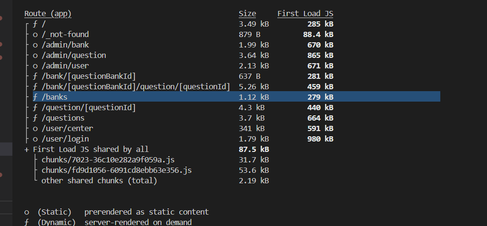

## 题库数据不一致

已经删除的题库在页面还能显示出来，已经添加的题库在页面显示不出来。

第一反应清除缓存，但是没什么用。

第二就是看数据库，发现数据库确实改变了。


第三反应测接口，由于是Next.js渲染，只能找到接口文档去测试。

发现和数据库一致。


那就是前端的问题。

由于使用的next.js渲染技术

打包的时候可以发现banks 是静态生成的，也就是banks页面即使更改也不会改变。

这不是我们所需要的、


将banks页面改为动态

修改bug


```.ts
// 本页面使用服务端渲染，禁用静态生成  开头就不能使用user server
export const dynamic = 'force-dynamic';
```



打包后调整文件位置 static 复制到.next 下，

将根目录下的 /pubulic 复制到.next/standalone内

把.next/static 目录移动到.next/standalone/.next内


将standalone打包上传到服务器。

解决

