# 项目介绍

 面试狗，帮助求职者更加有效的寻找面试题。

# 项目背景

面试题整理起来搜索不方便。

# 核心业务流程


# 项目功能梳理

**基础功能P0**

* 用户模块
  * 用户注册
  * 登录
  * [管理员]管理用户-增删改查。
* 题库模块
  * 查看题库列表
  * 查看题库详情（题库下的题目）
  * [管理员]管理题库-增删改查。
* 题目模块
  * 题目搜索
  * 查看题目详情
  * 【管理员】管理题目

**高级功能P1~P2**

* 题目批量管理 P1
  * 【管理员】批量向题目添加题目
  * 【管理员】批量从题库移除题目
  * 【管理员】批量删除题目
* 分词题目搜索 P1
* 用户刷题记录日历图P1
* 自动缓存热门题目P2
* 通断登录冲突检测P2


# 环境准备

jdk17

mysql 8

# 库表设计

```sql
-- 创建库
create database if not exists mianshidog;

-- 切换库
use mianshidog;

-- 用户表
create table if not exists user
(
    id           bigint auto_increment comment 'id' primary key,
    userAccount  varchar(256)                           not null comment '账号',
    userPassword varchar(512)                           not null comment '密码',
    unionId      varchar(256)                           null comment '微信开放平台id',
    mpOpenId     varchar(256)                           null comment '公众号openId',
    userName     varchar(256)                           null comment '用户昵称',
    userAvatar   varchar(1024)                          null comment '用户头像',
    userProfile  varchar(512)                           null comment '用户简介',
    userRole     varchar(256) default 'user'            not null comment '用户角色：user/admin/ban',
    editTime     datetime     default CURRENT_TIMESTAMP not null comment '编辑时间',
    createTime   datetime     default CURRENT_TIMESTAMP not null comment '创建时间',
    updateTime   datetime     default CURRENT_TIMESTAMP not null on update CURRENT_TIMESTAMP comment '更新时间',
    isDelete     tinyint      default 0                 not null comment '是否删除',
    index idx_unionId (unionId)
) comment '用户' collate = utf8mb4_unicode_ci;

-- 题库表
create table if not exists question_bank
(
    id          bigint auto_increment comment 'id' primary key,
    title       varchar(256)                       null comment '标题',
    description text                               null comment '描述',
    picture     varchar(2048)                      null comment '图片',
    userId      bigint                             not null comment '创建用户 id',
    editTime    datetime default CURRENT_TIMESTAMP not null comment '编辑时间',
    createTime  datetime default CURRENT_TIMESTAMP not null comment '创建时间',
    updateTime  datetime default CURRENT_TIMESTAMP not null on update CURRENT_TIMESTAMP comment '更新时间',
    isDelete    tinyint  default 0                 not null comment '是否删除',
    index idx_title (title)
) comment '题库' collate = utf8mb4_unicode_ci;

-- 题目表
create table if not exists question
(
    id         bigint auto_increment comment 'id' primary key,
    title      varchar(256)                       null comment '标题',
    content    text                               null comment '内容',
    tags       varchar(1024)                      null comment '标签列表（json 数组）',
    answer     text                               null comment '推荐答案',
    userId     bigint                             not null comment '创建用户 id',
    editTime   datetime default CURRENT_TIMESTAMP not null comment '编辑时间',
    createTime datetime default CURRENT_TIMESTAMP not null comment '创建时间',
    updateTime datetime default CURRENT_TIMESTAMP not null on update CURRENT_TIMESTAMP comment '更新时间',
    isDelete   tinyint  default 0                 not null comment '是否删除',
    index idx_title (title),
    index idx_userId (userId)
) comment '题目' collate = utf8mb4_unicode_ci;

-- 题库题目表（硬删除）
create table if not exists question_bank_question
(
    id             bigint auto_increment comment 'id' primary key,
    questionBankId bigint                             not null comment '题库 id',
    questionId     bigint                             not null comment '题目 id',
    userId         bigint                             not null comment '创建用户 id',
    createTime     datetime default CURRENT_TIMESTAMP not null comment '创建时间',
    updateTime     datetime default CURRENT_TIMESTAMP not null on update CURRENT_TIMESTAMP comment '更新时间',
    UNIQUE (questionBankId, questionId)
) comment '题库题目' collate = utf8mb4_unicode_ci;
```


# 准备工作

mybaits-x生成相关代码。

使用我们写好的代码生成器，生成crud代码

数据模型开发dto和vo

# debug


## 数据准备

```sql
-- 初始数据
use mianshidog;

-- 用户表初始数据（密码是 12345678）
INSERT INTO user (id, userAccount, userPassword, unionId, mpOpenId, userName, userAvatar, userProfile, userRole)
VALUES (1, 'user1', 'b0dd3697a192885d7c055db46155b26a', 'unionId1', 'mpOpenId1', 'user1',
        'https://www.code-nav.cn/logo.png', '喜欢编程的小白', 'user'),
       (2, 'user2', 'b0dd3697a192885d7c055db46155b26a', 'unionId2', 'mpOpenId2', 'user2',
        'https://www.code-nav.cn/logo.png', '全栈开发工程师', 'user'),
       (3, 'user3', 'b0dd3697a192885d7c055db46155b26a', 'unionId3', 'mpOpenId3', 'user3',
        'https://www.code-nav.cn/logo.png', '前端爱好者', 'user'),
       (4, 'user4', 'b0dd3697a192885d7c055db46155b26a', 'unionId4', 'mpOpenId4', 'user4',
        'https://www.code-nav.cn/logo.png', '后端开发工程师', 'user'),
       (5, '李硕', 'b0dd3697a192885d7c055db46155b26a', NULL, NULL, 'hnsqls', 'https://www.code-nav.cn/logo.png',
        '系统管理员', 'admin');

-- 题库表初始数据
INSERT INTO question_bank (title, description, picture, userId)
VALUES ('JavaScript 基础', '包含 JavaScript 的基础知识题目',
        'https://pic.code-nav.cn/mianshiya/question_bank_picture/1777886594896760834/JldkWf9w_JavaScript.png', 1),
       ('CSS 样式', '包含 CSS 相关的样式问题',
        'https://pic.code-nav.cn/mianshiya/question_bank_picture/1777886594896760834/QatnFmEN_CSS.png', 2),
       ('HTML 基础', 'HTML 标记语言的基本知识', 'https://www.mianshiya.com/logo.png', 3),
       ('前端框架', 'React, Vue, Angular 等框架相关的题目', 'https://www.mianshiya.com/logo.png', 1),
       ('算法与数据结构', '数据结构和算法题目', 'https://www.mianshiya.com/logo.png', 2),
       ('数据库原理', 'SQL 语句和数据库设计', 'https://www.mianshiya.com/logo.png', 3),
       ('操作系统', '操作系统的基本概念', 'https://www.mianshiya.com/logo.png', 1),
       ('网络协议', 'HTTP, TCP/IP 等网络协议题目', 'https://www.mianshiya.com/logo.png', 2),
       ('设计模式', '常见设计模式及其应用', 'https://www.mianshiya.com/logo.png', 3),
       ('编程语言概述', '多种编程语言的基础知识', 'https://www.mianshiya.com/logo.png', 1),
       ('版本控制', 'Git 和 SVN 的使用', 'https://www.mianshiya.com/logo.png', 2),
       ('安全与加密', '网络安全和加密技术', 'https://www.mianshiya.com/logo.png', 3),
       ('云计算', '云服务和架构', 'https://www.mianshiya.com/logo.png', 1),
       ('微服务架构', '微服务的设计与实现', 'https://www.mianshiya.com/logo.png', 2),
       ('容器技术', 'Docker 和 Kubernetes 相关知识', 'https://www.mianshiya.com/logo.png', 3),
       ('DevOps 实践', '持续集成与持续交付', 'https://www.mianshiya.com/logo.png', 1),
       ('数据分析', '数据分析和可视化', 'https://www.mianshiya.com/logo.png', 2),
       ('人工智能', '机器学习与深度学习基础', 'https://www.mianshiya.com/logo.png', 3),
       ('区块链技术', '区块链的基本原理和应用', 'https://www.mianshiya.com/logo.png', 1),
       ('项目管理', '软件开发项目的管理和执行', 'https://www.mianshiya.com/logo.png', 2);

-- 题目表初始数据
INSERT INTO question (title, content, tags, answer, userId)
VALUES ('JavaScript 变量提升', '请解释 JavaScript 中的变量提升现象。', '["JavaScript", "基础"]',
        '变量提升是指在 JavaScript 中，变量声明会被提升到作用域的顶部。', 1),
       ('CSS Flexbox 布局', '如何使用 CSS 实现一个水平居中的盒子？', '["CSS", "布局"]',
        '可以使用 Flexbox 布局，通过设置父容器 display 为 flex，并使用 justify-content: center; 对齐子元素。', 2),
       ('HTML 中的语义化', '什么是 HTML 的语义化？为什么重要？', '["HTML", "语义化"]',
        'HTML 语义化是使用正确的标签来描述内容的意义，能够提高可访问性和 SEO 效果。', 3),
       ('React 中的状态管理', '如何在 React 中管理组件状态？', '["React", "状态管理"]',
        '可以使用 React 的 useState 或 useReducer 钩子来管理组件状态，或使用 Redux 进行全局状态管理。', 1),
       ('算法：二分查找', '请实现一个二分查找算法。', '["算法", "数据结构"]',
        '二分查找是一种在有序数组中查找特定元素的算法，通过不断折半的方式缩小查找范围。', 2),
       ('数据库索引的作用', '什么是数据库索引？它的作用是什么？', '["数据库", "索引"]',
        '数据库索引是用于加快查询速度的数据结构，它通过优化查找路径减少查询时间。', 3),
       ('HTTP 与 HTTPS 的区别', '请解释 HTTP 和 HTTPS 之间的主要区别。', '["网络", "协议"]',
        'HTTPS 是加密的 HTTP，通过 SSL/TLS 提供更安全的数据传输。', 1),
       ('设计模式：单例模式', '请解释单例模式的实现及应用场景。', '["设计模式", "单例"]',
        '单例模式确保一个类只有一个实例，并提供全局访问点。常用于配置类等只需一个实例的场景。', 2),
       ('Git 中的分支管理', '如何在 Git 中管理分支？', '["版本控制", "Git"]',
        'Git 中通过 branch 命令创建分支，使用 checkout 切换分支，使用 merge 合并分支。', 3),
       ('Docker 的基本命令', '列举并解释几个常用的 Docker 命令。', '["容器技术", "Docker"]',
        '常用命令包括 docker run, docker build, docker ps, docker stop 等。', 1),
       ('前端性能优化', '列举几个前端性能优化的手段。', '["前端", "性能优化"]',
        '包括代码分割、资源压缩、缓存策略、懒加载等。', 2),
       ('JavaScript 闭包的应用', '什么是闭包？举例说明闭包的实际应用。', '["JavaScript", "高级"]',
        '闭包是指函数能够记住创建时的上下文环境，常用于数据隐藏和模块化编程。', 3),
       ('数据库事务的特性', '请解释数据库事务的 ACID 特性。', '["数据库", "事务"]',
        'ACID 代表原子性、一致性、隔离性和持久性，是事务处理的四大特性。', 1),
       ('CSS 的 BEM 命名规范', '什么是 BEM？如何使用 BEM 进行 CSS 命名？', '["CSS", "命名规范"]',
        'BEM 代表块（Block）、元素（Element）和修饰符（Modifier），是一种 CSS 命名规范。', 2),
       ('JavaScript 原型链', '请解释 JavaScript 中的原型链机制。', '["JavaScript", "原型链"]',
        '原型链是 JavaScript 实现继承的机制，对象通过原型链可以继承其他对象的属性和方法。', 3),
       ('React 生命周期', '请说明 React 组件的生命周期方法。', '["React", "生命周期"]',
        'React 组件的生命周期包括初始化、更新和卸载三个阶段，各阶段有不同的生命周期方法。', 1),
       ('HTTP 状态码 404 与 500 的区别', '请解释 HTTP 状态码 404 和 500 的含义。', '["网络", "HTTP"]',
        '404 表示未找到资源，500 表示服务器内部错误。', 2),
       ('Python 与 Java 的区别', '比较 Python 和 Java 的主要区别。', '["编程语言", "Python", "Java"]',
        'Python 是动态类型语言，语法简洁，而 Java 是静态类型语言，注重严谨性和性能。', 3),
       ('Vue 的双向数据绑定', '请解释 Vue.js 是如何实现双向数据绑定的。', '["Vue", "数据绑定"]',
        'Vue.js 通过数据劫持和发布-订阅模式实现了双向数据绑定。', 1),
       ('前端工程化的意义', '为什么需要前端工程化？', '["前端", "工程化"]',
        '前端工程化能够提高开发效率、代码质量和可维护性，规范开发流程。', 2);

-- 题库题目关联初始数据
INSERT INTO question_bank_question (questionBankId, questionId, userId)
VALUES (1, 1, 1),
       (1, 2, 1),
       (1, 3, 1),
       (1, 4, 1),
       (1, 5, 1),
       (1, 6, 1),
       (1, 7, 1),
       (1, 8, 1),
       (1, 9, 1),
       (1, 10, 1),
       (2, 2, 2),
       (2, 14, 2),
       (3, 3, 3),
       (3, 13, 3),
       (4, 4, 1),
       (4, 16, 1),
       (5, 5, 2),
       (5, 18, 2),
       (6, 6, 3),
       (6, 19, 3),
       (7, 7, 1),
       (7, 11, 1),
       (8, 8, 2),
       (8, 10, 2),
       (9, 9, 3),
       (9, 17, 3),
       (10, 12, 1),
       (10, 20, 1);

```

# 扩展功能

## 1.用户签到记录

### 1.1 需求分析

为了鼓励用户多刷题，开发签到记录，并以日历图的方式显示。

### 1.2 方案设计

**1.2.1 方案一 数据库**

数据库存签到信息，通过唯一索引确保一天签到一次

```sql
CREATE TABLE user_sign_in (
  id BIGINT AUTO_INCREMENT PRIMARY KEY,  -- 主键，自动递增
  userId BIGINT NOT NULL,               -- 用户ID，关联用户表
  signDate DATE NOT NULL,            -- 签到日期
  createdTime TIMESTAMP DEFAULT CURRENT_TIMESTAMP,  -- 记录创建时间
  UNIQUE KEY uq_user_date (userId, signDate)  -- 用户ID和签到日期的唯一性约束
);

```

查询用户的签到信息

```sql
SELECT signDate FROM user_sign_in 
WHERE userId = ? AND signDate BETWEEN ？AND ?;
```

优点：原理简单，实现容易

缺点：随着用户的数量增大，对数据库的压力较大

**1.2.2 方案二-Redis Set**

redis key : `user:signins:{userid}`

redis value : `2024-09-28`

如下命令新增集合

```shell
SADD user:signins:123 "2024-09-01"
SADD user:signins:123 "2024-09-02"
```

查找记录

```shell
SMEMBERS user:signins:123
```

优点：set结构天然去重，redis基于内存速度块。

缺点：上述设计存储了大量的重复的字符串如年份，太浪费内存了

如下存的数据，可以将年份提取作为key的部分，这样存储的数据就减少了很多

```shell
key = user:signins:123
value = ["2024-09-01", "2024-09-02", "2024-10-01", "2024-10-02"]
```

**1.2.3方案三-Bitmap位图**

bitmap位图是一种使用（bit）位来表示数据的紧凑数据结构，每一位能存0或1，用来表示某种状态或标识，因为每为只占用一bit位，Bitmap在存储大规模二值数据（如布尔）非常高效且节约空间。


用Bitmap来做签到的核心思想是：存储用户在今年的第几天签到，而不是存一个完整的日期。

```java
2024-01-01 => 1（第一天）
2024-01-03 => 3（第三天）
```

使用Bitmap类型存数据，每个用户对应一个key，BiyMap的每一位来表示某一天是否打卡。

如下例： 0表示未签到，1表示签到

```java
0101 表示第 1 天和第 3 天已签到
1010 表示第 2 天和第 4 天已签到
```

那么如何使用bitmap呢？

JDK自带了BitSet类，Redis也支持bitmap数据结构。

RedisKey的设计：`user:signins:{年份}：{userid}`

RedisValue的设计：`01010010100` bitmap类型的数据。

用redis支持的bitmap操作如下

新增

```shell
-- 表示用户在第 240 天打卡
SETBIT user:signins:2024:123 240 1
-- 表示用户在第 241 天打卡
SETBIT user:signins:2024:123 241 1

```

查询

```shell
GETBIT user:signins:2024:123 240
```

在Java程序中提供了java客户带`Redission`

### 1.3 开发接口

明确开发接口： 在用户每日首次查询某个题目详情的时候，签到。

#### 1.3.1引入Redission

1.引入依赖

```xml
<dependency>
  <groupId>org.redisson</groupId>
  <artifactId>redisson</artifactId>
  <version>3.21.0</version>
</dependency>
```

2.配置redis参数

```yaml
  # Redis 配置
  # todo 需替换配置，然后取消注释
  redis:
    database: 1
    host: localhost
    port: 6379
    timeout: 5000
    password: 123456
```

3. 初始化redission客服端.在config包下创建

```java
/**
 * redisson配置
 */
@Configuration
@ConfigurationProperties(prefix = "spring.redis")
@Data
public class RedissonConfig {


    private  String host;

    private Integer port;

    private Integer database;

    private String password;

    @Bean
    public RedissonClient redissonClient(){
        Config config = new Config();
        config.useSingleServer()
                .setAddress("redis://" + host +":"+ port)
                .setDatabase(database)
                .setPassword(password);


        return Redisson.create(config);
    }
}
```

尝试启动项目看是否报错。

#### 1.3.2 添加刷题签到接口

触发时机：已登录用户查看题目详情时，调用接口，签到。

业务逻辑：已经登录用户，查看题目详情，判断今天是否已经签到，未签到就在bitmap新增，已签到就不用处理。

rediskey 设计：`mainshidog:user:signins:{year}:{userid}` 

因为对redi读写 需要多次读写相同的key，所以将redis key 的定义单独放在一起定义常量.


1.在constant包下创建

```java
public interface RedisConstant {

    /**
     * 用户签到记录的 Redis Key 前缀
     */
    String USER_SIGN_IN_REDIS_KEY_PREFIX = "user:signins";

    /**
     * 获取用户签到记录的 Redis Key
     * @param year 年份
     * @param userId 用户 id
     * @return 拼接好的 Redis Key
     */
    static String getUserSignInRedisKey(int year, long userId) {
        return String.format("%s:%s:%s", USER_SIGN_IN_REDIS_KEY_PREFIX, year, userId);
    }
}
```

2. UserService接口

   ```java
   /**
    * 添加用户签到记录
    *
    * @param userId 用户 id
    * @return 当前是否已签到成功
    */
   boolean addUserSignIn(long userId);
   
   ```

3. 编写实现类

```java
    /**
     * 添加用户签到记录
     *
     * @param userId 用户签到
     * @return 当前是否已签到成功
     */
    public boolean addUserSignIn(long userId) {
        // 当前日期
        LocalDate localDate = LocalDate.now();
        int year = localDate.getYear();
        String key = RedisConstant.getUserSignInRedisKey(year, userId);

        //获取bitmap 数据
        RBitSet bitSet = redissonClient.getBitSet(key);
        //一年的偏移量  从一开始
        int dayOfYear = localDate.getDayOfYear();
        //是否已经签到
        if (!bitSet.get(dayOfYear)){
            //没有签到
            bitSet.set(dayOfYear,true);
        }
        //已经签到
        return  true;
        
    }
```

4. 编写controller请求

```java
    /**
     * 新增用户刷题签到记录
     *
     * @param
     * @param request
     * @return
     */
    @PostMapping("/add/sign_in")
    public BaseResponse<Boolean> addUserSignIn(HttpServletRequest request) {
        //登录的用户
        User loginUser = userService.getLoginUser(request);
        boolean result= userService.addUserSignIn(loginUser.getId());
        return ResultUtils.success(result);
    }
```

接口测试

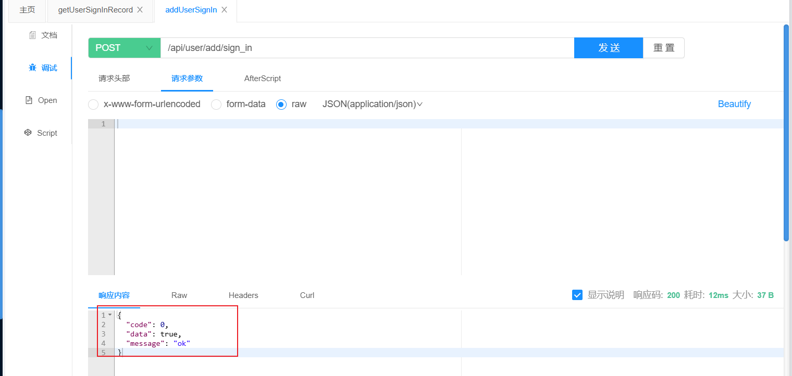

#### 1.3.3查询查询签到接口

业务逻辑： 1.通过userid和年份查询bitmap。2.获取年份天数，3.拼接日期，根据日期去bitmap中查是否签到，并记录在数组中

4.将拼接好的一年内的记录返回前端。

1. Userservice接口

```java
  /**
     * 获取签到记录
     * @param year
     * @param userid
     * @return  一整年签到记录的集合  [[2024-09-28:true],[2024-09-29:false],[2024-09-30:false]]
     */
    Map<LocalDate,Boolean> getUserSignIn(Integer year,long userid);
```

2. 实现类

```java
 /**
     * 获取签到记录
     * @param year
     * @param userid
     * @return  一整年签到记录的集合  [[2024-09-28:true],[2024-09-29:false],[2024-09-30:false]]
     */
    @Override
    public Map<LocalDate, Boolean> getUserSignIn(Integer year, long userid) {
        //不传年份，默认当年

        if (year == null){
            LocalDate now = LocalDate.now();
            year = now.getYear();
        }
        //获取signInkey
        String userSignInRedisKey = RedisConstant.getUserSignInRedisKey(year, userid);
        //获取bitmap数据
        RBitSet signbitSet = redissonClient.getBitSet(userSignInRedisKey);

        // 构造返回结果 linkedHashMap保证有序
        LinkedHashMap<LocalDate, Boolean> result = new LinkedHashMap<>();

        //获取当前年总天数
        int totalDays = Year.of(year).length();

        //依次获取每一天的签到状态
        for (int dayOfYear = 1; dayOfYear <= totalDays; dayOfYear++) {
            // 获取key ： 当前日期
           LocalDate currentDate = LocalDate.ofYearDay(year, dayOfYear);
            // 获取 value ： 当前是否有刷题
            boolean hasRecord = signbitSet.get(dayOfYear);
            result.put(currentDate,hasRecord);
        }

        return result;
    }
```

3. cotroller

```java
    /**
     * 获取用户签到记录
     *
     * @param year    年份（为空表示当前年份）
     * @param request
     * @return 签到记录映射
     */
    @GetMapping("/get/sign_in")
    public BaseResponse<Map<LocalDate, Boolean>> getUserSignInRecord(Integer year, HttpServletRequest request) {
        // 必须要登录才能获取
        User loginUser = userService.getLoginUser(request);
        Map<LocalDate, Boolean> userSignInRecord = userService.getUserSignIn(year,loginUser.getId());
        return ResultUtils.success(userSignInRecord);
    }
```

4.接口测试

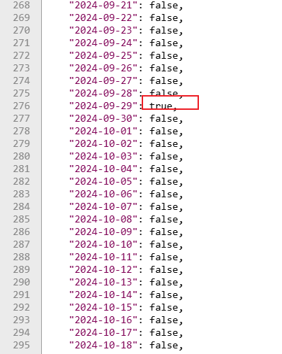


### 1. 4性能优化

1. **判断每天是否签到逻辑优化**

下述代码，循环内如需要判断当天是否刷题，实际上每次判断都去Redis交互，一个循环要交互365次redis.

```java
// 依次获取每一天的签到状态
for (int dayOfYear = 1; dayOfYear <= totalDays; dayOfYear++) {
    // 获取 key：当前日期
    LocalDate currentDate = LocalDate.ofYearDay(year, dayOfYear);
    // 获取 value：当天是否有刷题
    boolean hasRecord = signInBitSet.get(dayOfYear);
    // 将结果放入 map
    result.put(currentDate, hasRecord);
}
```

`signinBitSet`是通过Redisson客户端与Redis交互`RBitSet`对象，而`RBitSet.get(int bitIndex)`这个方法会触发依次Rredis请求来获取对应的值，并没有左本地缓存。

解决方法： 我们在循环外缓存一下BitMap数据，可以使用JDK自带的BitSet数据结果做本地缓存。

```java
// 加载 BitSet 到内存中，避免后续读取时发送多次请求
BitSet bitSet = signInBitSet.asBitSet();
// 获取 value：当天是否有刷题
boolean hasRecord = bitSet.get(dayOfYear);
```


2. **刷题记录返回结果优化**

我们在返回数据时的数据结构为：


传输的数据较多，计算时间耗时，宽带占用多，效率低。

实际上没有必要完全组装好数据传输给前端，仅仅告诉前端那天有刷题就行，这样大大减少传输的数据量以及后端cpu占用，将部分计算压力均摊到用户的客户端上（浏览器）

返回的数据：1 2 3 

修改代码如下：

```java
@Override
public List<Integer> getUserSignInRecord(long userId, Integer year) {
    if (year == null) {
        LocalDate date = LocalDate.now();
        year = date.getYear();
    }
    String key = RedisConstant.getUserSignInRedisKey(year, userId);
    RBitSet signInBitSet = redissonClient.getBitSet(key);
    // 加载 BitSet 到内存中，避免后续读取时发送多次请求
    BitSet bitSet = signInBitSet.asBitSet();
    // 统计签到的日期
    List<Integer> dayList = new ArrayList<>();
    // 获取当前年份的总天数
    int totalDays = Year.of(year).length();
    // 依次获取每一天的签到状态
    for (int dayOfYear = 1; dayOfYear <= totalDays; dayOfYear++) {
        // 获取 value：当天是否有刷题
        boolean hasRecord = bitSet.get(dayOfYear);
        if (hasRecord) {
          dayList.add(dayOfYear);
        }
    }
    return dayList;
}

```

接口测试

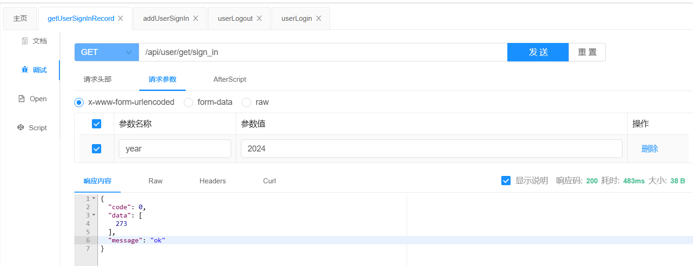

3. **计算优化**

BitSet 是一bit位存数据的一个数据结构，只能存01，我们可以使用位运算，代替使用上述for循环的检查逻辑，跳过无用的检查。

在Java中的`BitSet`类中可以使用`nextSetBit(int fromIndex)`和`nextClearBit(int fromIndex)`方法来获取从指定下标开始的下一个（1或0）的位.

* `nextSetBit(int fromIndex)`:从`formindex`起（包括`fromindex`）寻找下一个为1的位，如果找到返回该位的下标，如果未找到返回 -1.
* `nextClearBit(int fromIndex) `：从`formindex`起（包括`fromindex`）寻找下一个为0的位，如果找到返回该位的下标，如果未找到返回 大的整数值

之所以能跳过无用循环的原因在于，代码如下

```java
public int nextSetBit(int fromIndex) {
        if (fromIndex < 0)
            throw new IndexOutOfBoundsException("fromIndex < 0: " + fromIndex);

        checkInvariants();

        int u = wordIndex(fromIndex);
        if (u >= wordsInUse)
            return -1;

        long word = words[u] & (WORD_MASK << fromIndex);

        while (true) {
            if (word != 0)
                return (u * BITS_PER_WORD) + Long.numberOfTrailingZeros(word);
            if (++u == wordsInUse)
                return -1;
            word = words[u];
        }
    }
```

业务代码修改如下

```java
     //依次获取每一天的签到状态 优化版
        int i = bitSet.nextSetBit(0);
        while (i >= 0){
            result.add(i);
           i =  bitSet.nextSetBit(i+1);
        }

```

**优化小结**

1. 减少网路请求或调用次数
2. 减少传输数据的体积
3. 减少循环计算
4. 通过客户端减少服务器压力


## 2. 分词的题目搜索

### 2.1需求分析

由于我们使用sql的模糊查询，在进行下述操作中，并不能搜到题目，模糊查询不灵活。

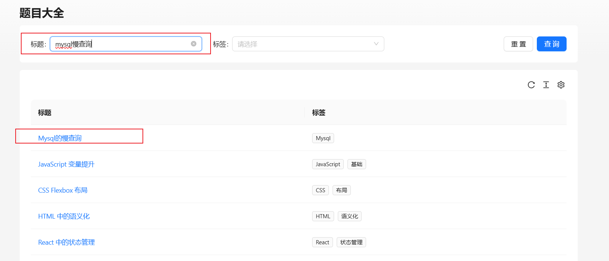

### 2.2 方案设计

使用Elasticsearch实现题目数据的存储和分词搜索，需要将数据库的数据同步到Elasticsearch中。

[Documentation (elastic.co)](https://www.elastic.co/docs)


### 2.3安装Elasticsearch

1.安装ES

版本选择7.17

安装参考文档：[Set up Elasticsearch | Elasticsearch Guide [7.17\] | Elastic](https://www.elastic.co/guide/en/elasticsearch/reference/7.17/setup.html)

windows:[Install Elasticsearch with .zip on Windows | Elasticsearch Guide [7.17\] | Elastic](https://www.elastic.co/guide/en/elasticsearch/reference/7.17/zip-windows.html)

下载解压后：进入ES目录并执行启动命令：

```shell
.\bin\elasticsearch.bat
```

检验是否运行成功参考官方文档

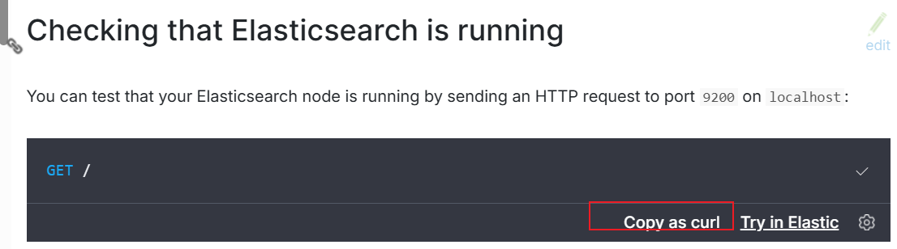

```shell
curl -X GET "localhost:9200/?pretty"
```

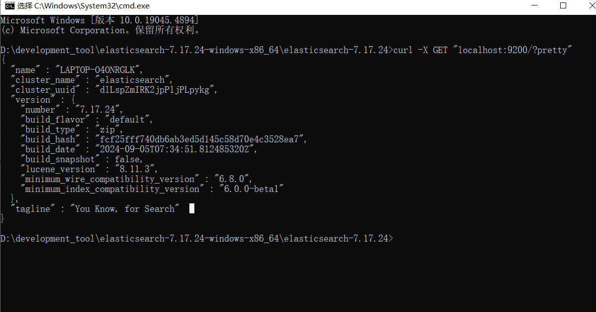


2. 安装Kibana  7.17

参考文档：[Kibana—your window into Elastic | Kibana Guide [7.17\] | Elastic](https://www.elastic.co/guide/en/kibana/7.17/introduction.html)

安装：[Install Kibana | Kibana Guide [7.17\] | Elastic](https://www.elastic.co/guide/en/kibana/7.17/install.html)

启动

```shell
.\bin\kibana.bat
```

配置

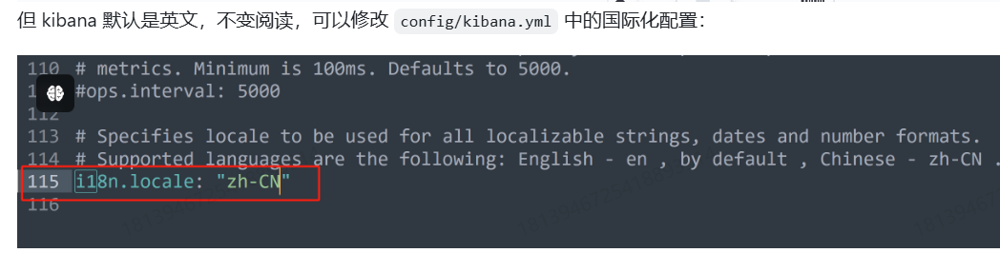

测试： 5601


分词器测试：localhost:5601

```json
POST /_analyze
{
  "analyzer": "standard", 
  "text": "李硕是java工程师，负责后端技术选型以及开发工作"
}

```

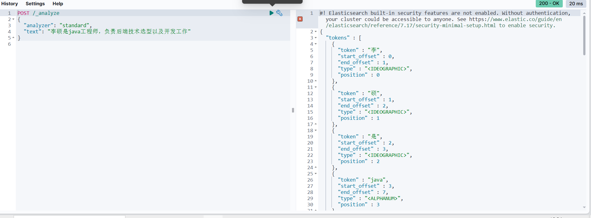

ES默认提供的分词器


但是这些分词器都不支持中文，所以需要安装ik中文分词器。

3. 安装ik分词器

参考文档：[infinilabs/analysis-ik: 🚌 The IK Analysis plugin integrates Lucene IK analyzer into Elasticsearch and OpenSearch, support customized dictionary. (github.com)](https://github.com/infinilabs/analysis-ik)

ik分词器版本要和ES版本一致：[Index of: analysis-ik/stable/ (infinilabs.com)](https://release.infinilabs.com/analysis-ik/stable/)

安装：进入es目录

```shell
.\bin\elasticsearch-plugin.bat install https://release.infinilabs.com/analysis-ik/stable/elasticsearch-analysis-ik-7.17.24.zip
```

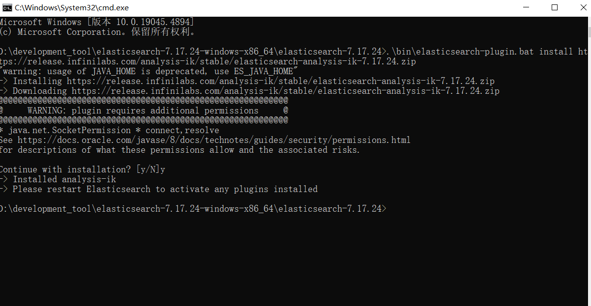

**ik分词器提供了两个分词器 ： `ik_smart`**和`ik_max_word`。

* ik_smart 是只能分词，尽量选择最想一个词的拆分方式比如“好学生被识别为一个词”
* ik_max_word 尽可能 的分词，包括组合词比如：“好学生” 被识别三个词：好学生，好学，学生

测试：

```json
POST /_analyze
{
  "analyzer": "ik_smart", 
  "text": "李硕是java工程师，负责后端技术选型以及开发工作"
}

```

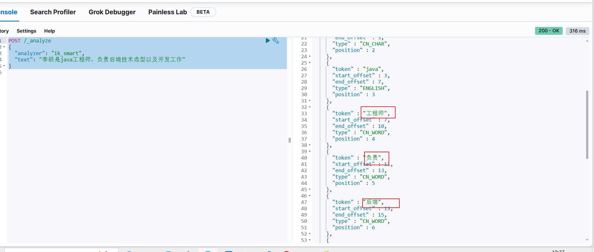

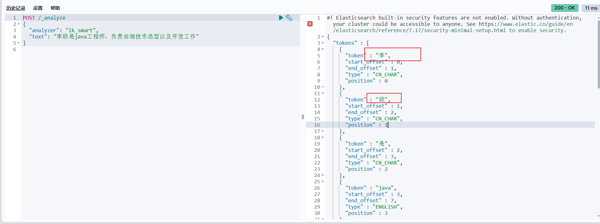

两个分词器的选用使用：

* `ik_smart`:**适用于搜索分词**，在查询使用，保证性能的同时提供合理的分词精度
* `ik_max_word`：**适用于底层索引分词**，确保在建立索引时尽可能的多分词，提高查询时的匹配度和覆盖面。

tips:**IK分词器识别词汇不准确，就如上述不认识“李硕”，那么怎么让ik按照自己的规则分词？**

可以使用自定义词典：[infinilabs/analysis-ik at v7.17.18 (github.com)](https://github.com/infinilabs/analysis-ik/tree/v7.17.18?tab=readme-ov-file#dictionary-configuration)


### 2.4 创建ES库

```json
PUT /question_v1
{
  "aliases": {
    "question": {}
  },
  "mappings": {
    "properties": {
      "title": {
        "type": "text",
        "analyzer": "ik_max_word",
        "search_analyzer": "ik_smart",
        "fields": {
          "keyword": {
            "type": "keyword",
            "ignore_above": 256
          }
        }
      },
      "content": {
        "type": "text",
        "analyzer": "ik_max_word",
        "search_analyzer": "ik_smart"
      },
      "tags": {
        "type": "keyword"
      },
      "answer": {
        "type": "text",
        "analyzer": "ik_max_word",
        "search_analyzer": "ik_smart"
      },
      "userId": {
        "type": "long"
      },
      "editTime": {
        "type": "date",
        "format": "yyyy-MM-dd HH:mm:ss"
      },
      "createTime": {
        "type": "date",
        "format": "yyyy-MM-dd HH:mm:ss"
      },
      "updateTime": {
        "type": "date",
        "format": "yyyy-MM-dd HH:mm:ss"
      },
      "isDelete": {
        "type": "keyword"
      }
    }
  }
}
```

### 2.5 创建ES客户端

1. 引入依赖

```xml
<!-- elasticsearch-->
<dependency>
    <groupId>org.springframework.boot</groupId>
    <artifactId>spring-boot-starter-data-elasticsearch</artifactId>
</dependency>
```

2. yaml配置

```yaml
spring:
  elasticsearch:
    uris: http://xxx:9200
    username: elastic
    password: admin
```


3. 使用

SpringDateEs Template

或者继承


### 2.6开发

ESDTO

```java

@Document(indexName = "question")
@Data
public class QuestionEsDTO implements Serializable {
    private static final String DATE_TIME_PATTERN = "yyyy-MM-dd HH:mm:ss";
    /**
     * id
     */
    @Id
    private Long id;
    /**
     * 标题
     */
    private String title;
    /**
     * 内容
     */
    private String content;
    /**
     * 答案
     */
    private String answer;
    /**
     * 标签列表
     */
    private List<String> tags;
    /**
     * 创建用户 id
     */
    private Long userId;
    /**
     * 创建时间
     */
    @Field(type = FieldType.Date, format = {}, pattern = DATE_TIME_PATTERN)
    private Date createTime;
    /**
     * 更新时间
     */
    @Field(type = FieldType.Date, format = {}, pattern = DATE_TIME_PATTERN)
    private Date updateTime;
    /**
     * 是否删除
     */
    private Integer isDelete;
    private static final long serialVersionUID = 1L;
    /**
     * 对象转包装类
     *
     * @param question
     * @return
     */
    public static QuestionEsDTO objToDto(Question question) {
        if (question == null) {
            return null;
        }
        QuestionEsDTO questionEsDTO = new QuestionEsDTO();
        BeanUtils.copyProperties(question, questionEsDTO);
        String tagsStr = question.getTags();
        if (StrUtil.isNotBlank(tagsStr)) {
            questionEsDTO.setTags(JSONUtil.toList(tagsStr, String.class));
        }
        return questionEsDTO;
    }
    /**
     * 包装类转对象
     *
     * @param questionEsDTO
     * @return
     */
    public static Question dtoToObj(QuestionEsDTO questionEsDTO) {
        if (questionEsDTO == null) {
            return null;
        }
        Question question = new Question();
        BeanUtils.copyProperties(questionEsDTO, question);
        List<String> tagList = questionEsDTO.getTags();
        if (CollUtil.isNotEmpty(tagList)) {
            question.setTags(JSONUtil.toJsonStr(tagList));
        }
        return question;
    }
}
```

DAO

```java
/**
 * 题目 ES 操作

 */
public interface QuestionEsDao extends ElasticsearchRepository<QuestionEsDTO, Long> {


//    List<QuestionEsDao> findByUserId(Long userId);
}
```

全量同步到ES

```java
import cn.hutool.core.collection.CollUtil;
import com.ls.mianshidog.esdao.QuestionEsDao;
import com.ls.mianshidog.model.dto.question.QuestionEsDTO;
import com.ls.mianshidog.model.entity.Question;
import com.ls.mianshidog.model.entity.User;
import com.ls.mianshidog.service.QuestionService;
import lombok.extern.slf4j.Slf4j;
import org.springframework.boot.CommandLineRunner;
import org.springframework.stereotype.Component;
import javax.annotation.Resource;
import java.util.List;
import java.util.stream.Collectors;
/**
 * 全量同步题目到 es

 */
// todo 取消注释开启任务
@Component
@Slf4j
public class FullSyncQuestionToEs implements CommandLineRunner {
    @Resource
    private QuestionService questionService;
    @Resource
    private QuestionEsDao questionEsDao;
    @Override
    public void run(String... args) {
        // 全量获取题目（数据量不大的情况下使用）
        List<Question> questionList = questionService.list();
        if (CollUtil.isEmpty(questionList)) {
            return;
        }
        // 转为 ES 实体类
        List<QuestionEsDTO> questionEsDTOList = questionList.stream()
                .map(QuestionEsDTO::objToDto)
                .collect(Collectors.toList());
        // 分页批量插入到 ES
        final int pageSize = 500;
        int total = questionEsDTOList.size();
        log.info("FullSyncQuestionToEs start, total {}", total);
        for (int i = 0; i < total; i += pageSize) {
            // 注意同步的数据下标不能超过总数据量
            int end = Math.min(i + pageSize, total);
            log.info("sync from {} to {}", i, end);
            User user = new User();

            questionEsDao.saveAll(questionEsDTOList.subList(i,end));
//            questionEsDao.saveAll(questionEsDTOList.subList(i, end));
        }
        log.info("FullSyncQuestionToEs end, total {}", total);
    }
}


```

测试  开始注释，启动项目，查询ES数据

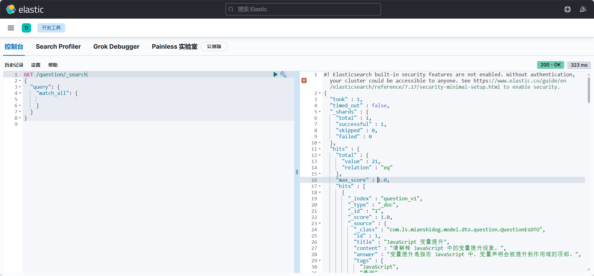


增量同步

```java
/**
 * 增量同步帖子到 es

 */
// todo 取消注释开启任务
@Component
@Slf4j
public class IncSyncQuestionToEs {
    @Resource
    private QuestionMapper questionMapper;
    @Resource
    private QuestionEsDao questionEsDao;
    /**
     * 每分钟执行一次
     */
    @Scheduled(fixedRate = 60 * 1000)
    public void run() {
        // 查询近 5 分钟内的数据
        long FIVE_MINUTES = 5 * 60 * 1000L;
        Date fiveMinutesAgoDate = new Date(new Date().getTime() - FIVE_MINUTES);
        List<Question> questionList = questionMapper.listQuestionWithDelete(fiveMinutesAgoDate);
        if (CollUtil.isEmpty(questionList)) {
            log.info("no inc question");
            return;
        }
        List<QuestionEsDTO> questionEsDTOList = questionList.stream()
                .map(QuestionEsDTO::objToDto)
                .collect(Collectors.toList());
        final int pageSize = 500;
        int total = questionEsDTOList.size();
        log.info("IncSyncQuestionToEs start, total {}", total);
        for (int i = 0; i < total; i += pageSize) {
            int end = Math.min(i + pageSize, total);
            log.info("sync from {} to {}", i, end);
            questionEsDao.saveAll(questionEsDTOList.subList(i, end));
        }
        log.info("IncSyncQuestionToEs end, total {}", total);
    }
}
```

实现方法   `questionMapper.listQuestionWithDelete(fiveMinutesAgoDate);`

```java
public interface QuestionMapper extends BaseMapper<Question> {

    @Select("select * from question where updateTime >= #{minUpdateTime}")
    List<Question> listQuestionWithDelete(Date fiveMinutesAgoDate);
}
```


测试 修改数据库

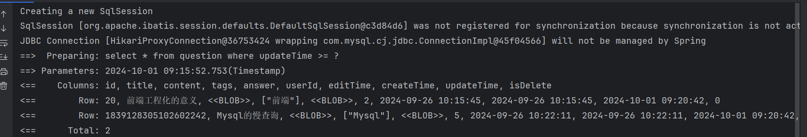

ES  搜索

questionService

```java
/**
 * 从 ES 查询题目
 *
 * @param questionQueryRequest
 * @return
 */
Page<Question> searchFromEs(QuestionQueryRequest questionQueryRequest);

```

实现

```java
 /**
     * 从 ES 查询题目
     *
     * @param questionQueryRequest
     * @return
     */
    @Override
    public Page<Question> searchFromEs(QuestionQueryRequest questionQueryRequest) {
        // 获取参数
        Long id = questionQueryRequest.getId();
        Long notId = questionQueryRequest.getNotId();
        String searchText = questionQueryRequest.getSearchText();
        List<String> tags = questionQueryRequest.getTags();
        Long questionBankId = questionQueryRequest.getQuestionBankId();
        Long userId = questionQueryRequest.getUserId();


        // 注意，ES 的起始页为 0
        int current = questionQueryRequest.getCurrent() - 1;
        int pageSize = questionQueryRequest.getPageSize();
        String sortField = questionQueryRequest.getSortField();
        String sortOrder = questionQueryRequest.getSortOrder();

        // 构造查询条件
        BoolQueryBuilder boolQueryBuilder = QueryBuilders.boolQuery();
        // 过滤
        boolQueryBuilder.filter(QueryBuilders.termQuery("isDelete", 0));
        if (id != null) {
            boolQueryBuilder.filter(QueryBuilders.termQuery("id", id));
        }
        if (notId != null) {
            boolQueryBuilder.mustNot(QueryBuilders.termQuery("id", notId));
        }
        if (userId != null) {
            boolQueryBuilder.filter(QueryBuilders.termQuery("userId", userId));
        }
        if (questionBankId != null) {
            boolQueryBuilder.filter(QueryBuilders.termQuery("questionBankId", questionBankId));
        }
        // 必须包含所有标签
        if (CollUtil.isNotEmpty(tags)) {
            for (String tag : tags) {
                boolQueryBuilder.filter(QueryBuilders.termQuery("tags", tag));
            }
        }
        // 按关键词检索
        if (StringUtils.isNotBlank(searchText)) {
            boolQueryBuilder.should(QueryBuilders.matchQuery("title", searchText));
            boolQueryBuilder.should(QueryBuilders.matchQuery("content", searchText));
            boolQueryBuilder.should(QueryBuilders.matchQuery("answer", searchText));
            boolQueryBuilder.minimumShouldMatch(1);
        }
        // 排序
        SortBuilder<?> sortBuilder = SortBuilders.scoreSort();
        if (StringUtils.isNotBlank(sortField)) {
            sortBuilder = SortBuilders.fieldSort(sortField);
            sortBuilder.order(CommonConstant.SORT_ORDER_ASC.equals(sortOrder) ? SortOrder.ASC : SortOrder.DESC);
        }
        // 分页
        PageRequest pageRequest = PageRequest.of(current, pageSize);
        // 构造查询
        NativeSearchQuery searchQuery = new NativeSearchQueryBuilder()
                .withQuery(boolQueryBuilder)
                .withPageable(pageRequest)
                .withSorts(sortBuilder)
                .build();
        SearchHits<QuestionEsDTO> searchHits = elasticsearchRestTemplate.search(searchQuery, QuestionEsDTO.class);
        // 复用 MySQL 的分页对象，封装返回结果
        Page<Question> page = new Page<>();
        page.setTotal(searchHits.getTotalHits());
        List<Question> resourceList = new ArrayList<>();
        if (searchHits.hasSearchHits()) {
            List<SearchHit<QuestionEsDTO>> searchHitList = searchHits.getSearchHits();
            for (SearchHit<QuestionEsDTO> questionEsDTOSearchHit : searchHitList) {
                resourceList.add(QuestionEsDTO.dtoToObj(questionEsDTOSearchHit.getContent()));
            }
        }
        page.setRecords(resourceList);
        return page;
    }
```


编写接口

```java
@PostMapping("/search/page/vo")
public BaseResponse<Page<QuestionVO>> searchQuestionVOByPage(@RequestBody QuestionQueryRequest questionQueryRequest,
                                                     HttpServletRequest request) {
    long size = questionQueryRequest.getPageSize();
    // 限制爬虫
    ThrowUtils.throwIf(size > 200, ErrorCode.PARAMS_ERROR);
    Page<Question> questionPage = questionService.searchFromEs(questionQueryRequest);
    return ResultUtils.success(questionService.getQuestionVOPage(questionPage, request));
}

```

测试

之前的搜索

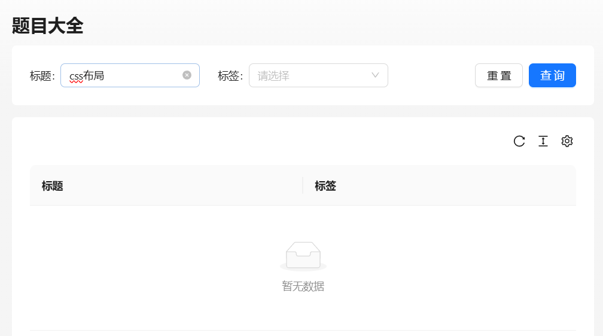

现在的搜索

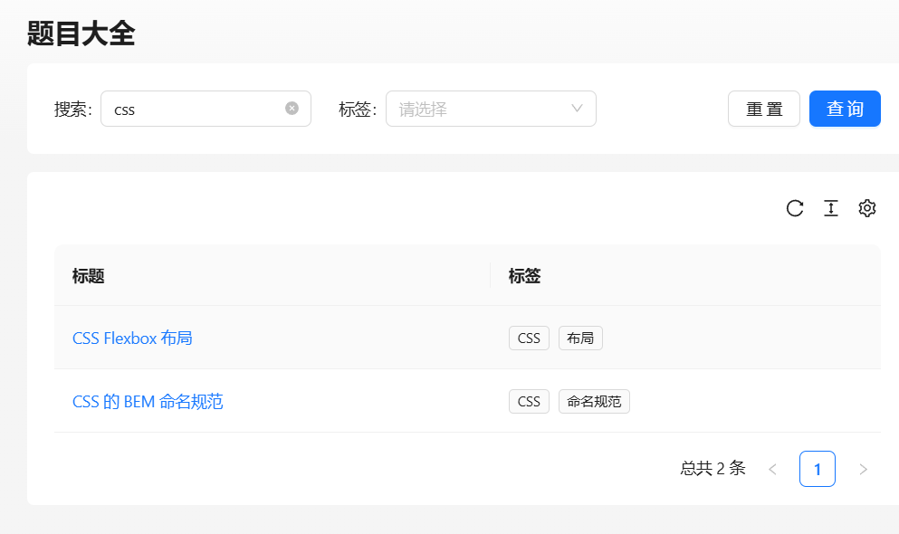