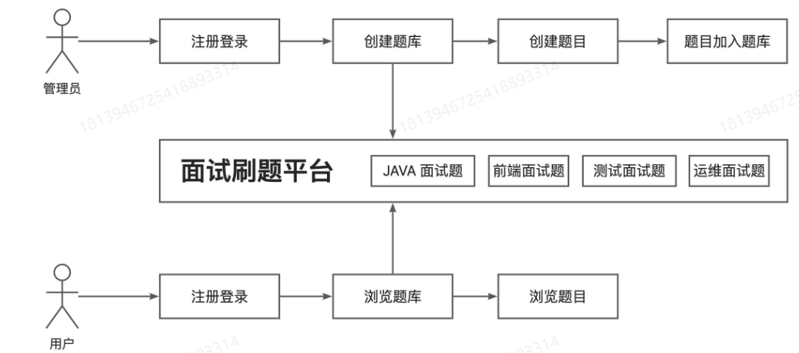

# 项目介绍

 面试狗，帮助求职者更加有效的寻找面试题。

# 项目背景

面试题整理起来搜索不方便。

# 核心业务流程




# 项目功能梳理

**基础功能P0**

* 用户模块
  * 用户注册
  * 登录
  * [管理员]管理用户-增删改查。
* 题库模块
  * 查看题库列表
  * 查看题库详情（题库下的题目）
  * [管理员]管理题库-增删改查。
* 题目模块
  * 题目搜索
  * 查看题目详情
  * 【管理员】管理题目

**高级功能P1~P2**

* 题目批量管理 P1
  * 【管理员】批量向题目添加题目
  * 【管理员】批量从题库移除题目
  * 【管理员】批量删除题目
* 分词题目搜索 P1
* 用户刷题记录日历图P1
* 自动缓存热门题目P2
* 通断登录冲突检测P2


# 环境准备

jdk17

mysql 8

# 库表设计

```sql
-- 创建库
create database if not exists mianshidog;

-- 切换库
use mianshidog;

-- 用户表
create table if not exists user
(
    id           bigint auto_increment comment 'id' primary key,
    userAccount  varchar(256)                           not null comment '账号',
    userPassword varchar(512)                           not null comment '密码',
    unionId      varchar(256)                           null comment '微信开放平台id',
    mpOpenId     varchar(256)                           null comment '公众号openId',
    userName     varchar(256)                           null comment '用户昵称',
    userAvatar   varchar(1024)                          null comment '用户头像',
    userProfile  varchar(512)                           null comment '用户简介',
    userRole     varchar(256) default 'user'            not null comment '用户角色：user/admin/ban',
    editTime     datetime     default CURRENT_TIMESTAMP not null comment '编辑时间',
    createTime   datetime     default CURRENT_TIMESTAMP not null comment '创建时间',
    updateTime   datetime     default CURRENT_TIMESTAMP not null on update CURRENT_TIMESTAMP comment '更新时间',
    isDelete     tinyint      default 0                 not null comment '是否删除',
    index idx_unionId (unionId)
) comment '用户' collate = utf8mb4_unicode_ci;

-- 题库表
create table if not exists question_bank
(
    id          bigint auto_increment comment 'id' primary key,
    title       varchar(256)                       null comment '标题',
    description text                               null comment '描述',
    picture     varchar(2048)                      null comment '图片',
    userId      bigint                             not null comment '创建用户 id',
    editTime    datetime default CURRENT_TIMESTAMP not null comment '编辑时间',
    createTime  datetime default CURRENT_TIMESTAMP not null comment '创建时间',
    updateTime  datetime default CURRENT_TIMESTAMP not null on update CURRENT_TIMESTAMP comment '更新时间',
    isDelete    tinyint  default 0                 not null comment '是否删除',
    index idx_title (title)
) comment '题库' collate = utf8mb4_unicode_ci;

-- 题目表
create table if not exists question
(
    id         bigint auto_increment comment 'id' primary key,
    title      varchar(256)                       null comment '标题',
    content    text                               null comment '内容',
    tags       varchar(1024)                      null comment '标签列表（json 数组）',
    answer     text                               null comment '推荐答案',
    userId     bigint                             not null comment '创建用户 id',
    editTime   datetime default CURRENT_TIMESTAMP not null comment '编辑时间',
    createTime datetime default CURRENT_TIMESTAMP not null comment '创建时间',
    updateTime datetime default CURRENT_TIMESTAMP not null on update CURRENT_TIMESTAMP comment '更新时间',
    isDelete   tinyint  default 0                 not null comment '是否删除',
    index idx_title (title),
    index idx_userId (userId)
) comment '题目' collate = utf8mb4_unicode_ci;

-- 题库题目表（硬删除）
create table if not exists question_bank_question
(
    id             bigint auto_increment comment 'id' primary key,
    questionBankId bigint                             not null comment '题库 id',
    questionId     bigint                             not null comment '题目 id',
    userId         bigint                             not null comment '创建用户 id',
    createTime     datetime default CURRENT_TIMESTAMP not null comment '创建时间',
    updateTime     datetime default CURRENT_TIMESTAMP not null on update CURRENT_TIMESTAMP comment '更新时间',
    UNIQUE (questionBankId, questionId)
) comment '题库题目' collate = utf8mb4_unicode_ci;
```


# 准备工作

mybaits-x生成相关代码。

使用我们写好的代码生成器，生成crud代码

数据模型开发dto和vo


